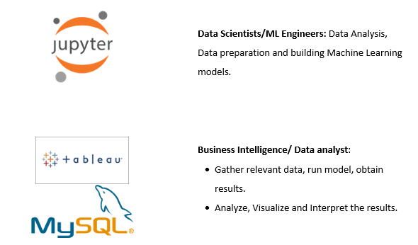

# Prediction of Absenteeism at Work using Python and SQL.
The aim of this project is to understand the flow of data in a real life business model. To understand this, I have integrated Jupyter notebook, MySQL workbench and tableau. The figure below shows the responsibilities of Data Scientists/ML engineers and Business Intelligence/Data Analysts.

## Business Understanding
Absenteeism is the term given when an employee is habitually and frequently absent from work. This excludes paid leave and occasions where an employer has granted an employee time off. According to [Forbes](https://www.forbes.com/sites/investopedia/2013/07/10/the-causes-and-costs-of-absenteeism-in-the-workplace/#4af53573eb65), Absenteeism costs U.S. companies billions of dollars each year in lost productivity, wages, poor quality of goods/services and excess management time. In addition, the employees who do show up to work are often burdened with extra duties and responsibilities to fill in for absent employees, which can lead to feelings of frustration and a decline in morale.

The aim of this project is to study the factors affecting the absenteeism of employee at work place and build a model to predict the absenteeism. The data for this analysis is taken from UCI Machine Learning Repository. http://archive.ics.uci.edu/ml/datasets/Absenteeism+at+work#

## Table of contents
* [General info](#general-info)
* [Flow diagram](#flow-diagram)
* [Technologies and Tools](#technologies-and-tools)
* [Important Libraries](#lib)
* [Code Example](#code-example)
* [Result](#result)

## Technologies and Tools:
* Python(Jupyter Notebook)
* MySQL Workbench
* Tableau

## Important Libraries
* Connection between MySQL workbench and Jupyter Notebook

## Code Example

## Result
* The accuracy of the training model is about 79.28%.
* The accuracy of the model when given a set of new data is 74.28%.

